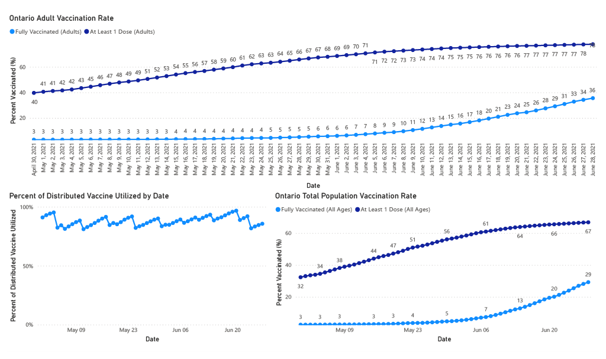

# COVID-19 Data Visualizations

This repository contains code and a PowerBI file for generating visualizations related to COVID-19 and the vaccination
effort in Ontario, Canada.

## Sample Images
The following are some example images from the PowerBI visualizations (note this data is for Ontario only). As these are
static images, the ability to interact with the graphs dynamically or refresh their data is not available.

### Ontario COVID-19 Status

### Ontario COVID-19 Vaccination Progress

## Requirements
covid_visualizations_jupyter.ipynb requires
- jupyter
- requests
- numpy
- pandas
- matplotlib
- seaborn

covid_visualizations.pbix requires PowerBI Desktop and access to a Python interpreter that has the libraries:
- requests
- pandas

## Data Source, Acknowledgement & Credit

Data from these visualizations comes from https://api.covid19tracker.ca/docs/1.0/overview.

Thanks to the API developer
and [the team](https://covid19tracker.ca/acknowledgements.html) behind it for generating this dataset and releasing it
to the public.